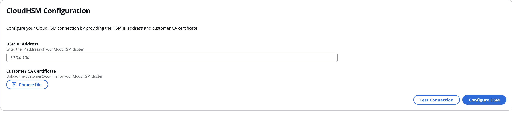
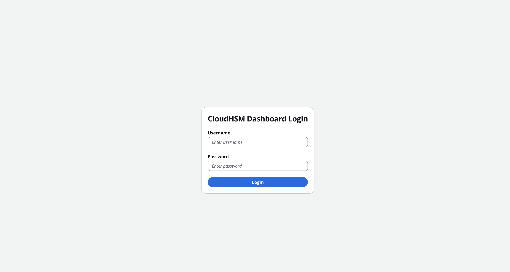
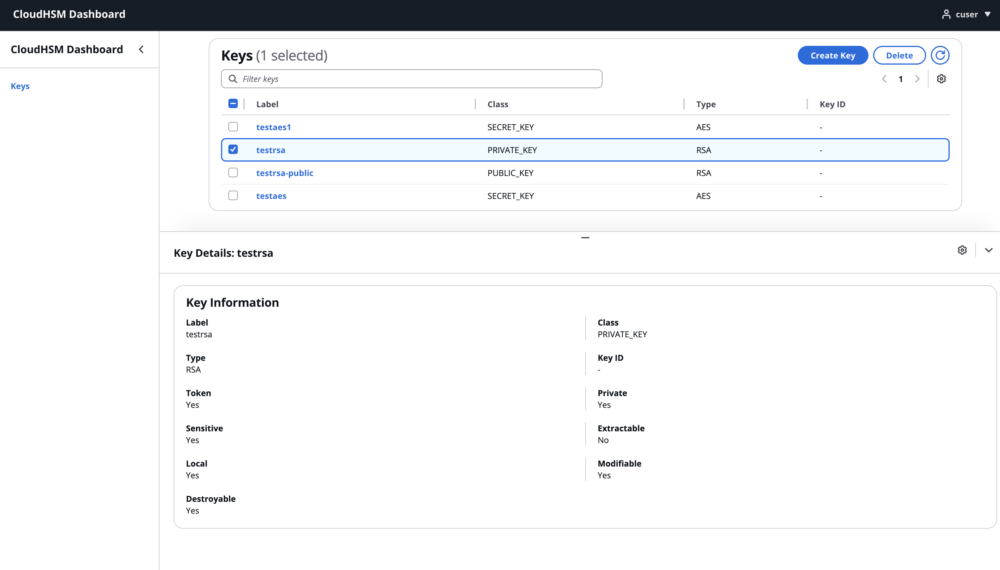
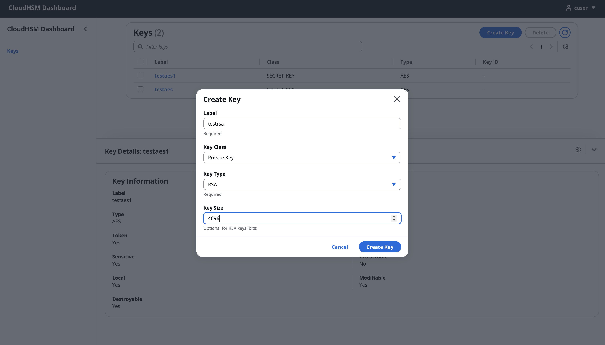
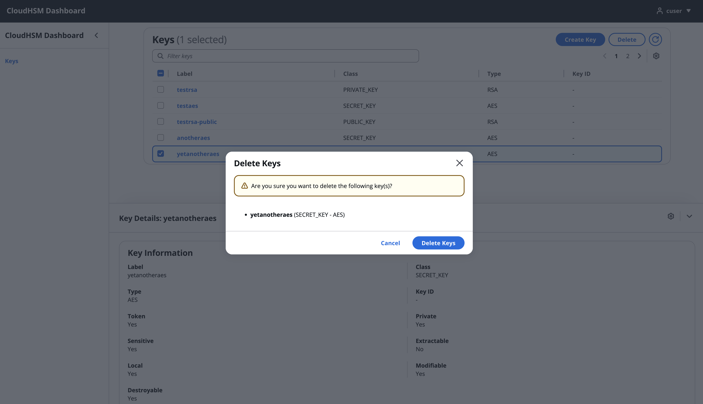

# CloudHSM Management Dashboard

A web-based interface for managing AWS CloudHSM clusters. This tool provides a simple way to handle cryptographic keys and HSM operations without dealing with command-line tools.

## What it does

The dashboard lets you configure your CloudHSM connection through a web interface, then manage your cryptographic keys with a clean UI. You can create AES, RSA, and EC keys, search through existing keys, and delete keys when needed. Everything runs in Docker, so setup is straightforward.

Built with React on the frontend and FastAPI on the backend, using PyKCS11 to talk directly to your CloudHSM cluster. Session data is stored in SQLite.


## Installation

### Prerequisites

- Docker and Docker Compose
- Git
- AWS CloudHSM cluster with initialized users

### Quick Start

1. **Clone the repository**
   ```bash
   git clone https://github.com/YOUR_USERNAME/cloudhsm-management-dashboard.git
   cd cloudhsm-management-dashboard
   ```

2. **Build the Docker image**
   ```bash
   chmod +x build.sh
   ./build.sh
   ```

3. **Start the application**
   ```bash
   # Using Docker Compose (recommended)
   docker-compose up -d
   
   # Or using Docker directly
   docker run -p 8000:8000 --privileged cloudhsm-dashboard:latest
   ```

4. **Access the application**
   ```
   http://localhost:8000
   ```

## Usage

### 1. HSM Configuration

When you first access the application, you'll be prompted to configure your CloudHSM connection:



- Enter your CloudHSM cluster IP address
- Upload the `customerCA.crt` certificate file
- Test the connection before saving

### 2. User Login

After HSM configuration, log in with your CloudHSM user credentials:



- Enter your HSM username and password
- The system will authenticate against the CloudHSM cluster

### 3. Key Management

#### View and Search Keys



- View all keys in your HSM cluster
- Search and filter by key type, class, or label
- View detailed key attributes and properties

#### Create New Keys



- Create AES symmetric keys
- Generate RSA and EC key pairs
- Configure key attributes (extractable, sensitive, etc.)
- Set custom labels for easy identification

#### Delete Keys



- Select multiple keys for deletion
- Confirm deletion with safety prompts
- Bulk operations for efficient key management

## Configuration

### Environment Variables

- `APP_PORT`: Application port (default: 8000)
- `PKCS11_LIB`: Path to PKCS11 library (default: `/opt/cloudhsm/lib/libcloudhsm_pkcs11.so`)

## Current Limitations

- **Single HSM Cluster Support** - Currently supports one HSM cluster at a time
- **Key Management Only** - Limited to key lifecycle operations
- **Basic User Authentication** - Simple username/password authentication
- **Limited Key Types** - Supports AES, RSA, and EC keys only

## Wishlist

- Encrypt/decrypt operations using HSM keys
- Digital signing and verification
- Key wrapping and unwrapping for secure import/export
- Multi-user support with role-based access control
- Quorum authentication for sensitive operations
- Audit logging and compliance reporting
- Multi-HSM cluster support
- Key versioning and rotation tracking
- Bulk key operations
- Two-factor authentication
- High availability and load balancing

